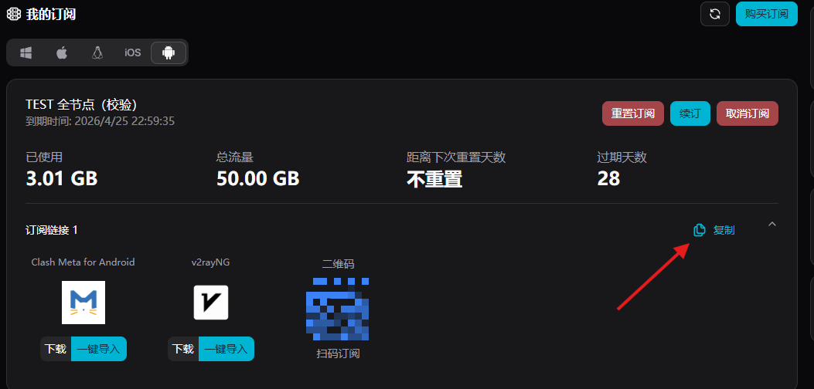
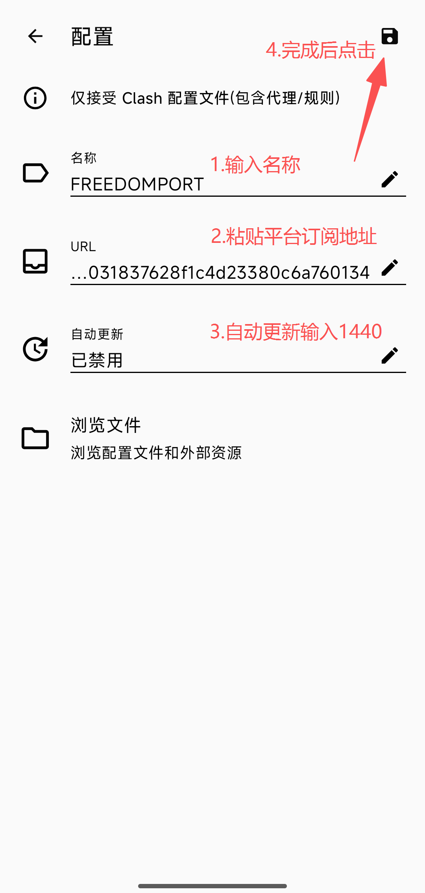

# ⚔️ Clash Meta for Android

> 🌟 **Android 规则分流主力客户端** | 功能完整、策略组灵活、兼容性高

[Clash Meta for Android](https://github.com/MetaCubeX/ClashMetaForAndroid) 基于 Clash Meta 内核，适合对规则分流、策略组、节点管理有较高要求的用户。

## ✨ 产品特色

### 🎯 核心优势

- 🆓 开源免费，持续维护。
- 🚀 内核性能稳定，适合长期使用。
- 🎨 界面清晰，配置入口集中。
- 🔧 支持多种策略分流方式。

### 🔗 协议支持

| 协议 | 支持状态 | 说明 |
|------|----------|------|
| VMess / VLESS | ✅ | 常用主流协议 |
| Trojan | ✅ | TLS 伪装常见方案 |
| Shadowsocks | ✅ | 兼容老方案 |
| Hysteria / WireGuard | ✅ | 视订阅而定 |

## 📱 系统要求

- 最低版本：Android 8.0+
- 推荐版本：Android 10+
- 存储空间：200MB 可用空间

## 📥 下载与安装

### 🔗 官方下载

- Android universal（直链）：https://github.com/MetaCubeX/ClashMetaForAndroid/releases/download/v2.11.24/cmfa-2.11.24-meta-universal-release.apk
- Android universal（🚀 镜像加速）：https://gh.xxooo.cf/https://github.com/MetaCubeX/ClashMetaForAndroid/releases/download/v2.11.24/cmfa-2.11.24-meta-universal-release.apk
- 当前参考版本：`v2.11.24`

### 🛠️ 安装步骤

1. 下载 `universal` 包。
2. 安装 APK。
3. 首次启动时允许 VPN 权限。

## 🚀 配置教程

### 🌟 步骤一：启动应用

### ⚙️ 步骤二：进入配置页

### 📥 步骤三：新增订阅

点击新增配置并选择 URL 导入。

### 📝 步骤四：粘贴订阅链接

### ⏳ 步骤五：等待配置拉取

### 🌐 步骤六：选择节点

### ✅ 步骤七：确认并保存

### 🚀 步骤八：开启代理

## 🎛️ 进阶功能

### 📊 规则分流

- 支持域名、IP、GeoIP 规则。
- 支持直连/代理/拒绝策略。

### 🔄 策略组

- 自动选择、手动选择、负载均衡。
- 节点异常时可快速切换。

### 📈 监控能力

- 实时流量统计。
- 规则命中与连接日志查看。

## ❓ 常见问题

**Q: 导入订阅后没有节点？**  
A: 先手动更新配置；确认订阅链接可访问；确认套餐有效。

**Q: 已连接但无法访问网站？**  
A: 切换节点重试；检查是否开启 VPN 权限；检查模式是否正确。

**Q: 节点延迟都很高？**  
A: 先更换网络环境，再切换到距离更近的节点组。

## 🔗 相关资源

- 项目主页：https://github.com/MetaCubeX/ClashMetaForAndroid
- 问题反馈：https://github.com/MetaCubeX/ClashMetaForAndroid/issues

---

> 📅 最后更新：2026年3月28日 | ⚔️ 适用版本：Clash Meta for Android v2.11.24
